# DIVI Intensivregister

## What are we dealing with?

[The divi](https://www.intensivregister.de/#/intensivregister) lists many (if not all) German clinics and their status of ICU /ECMO availability.

* green = /Verfügbar/ = available
* yellow = /Begrenzt/ = limited
* red = /Ausgelastet/ = exhausted
* unavailable = /Unbekannt/ = unknown

For plotting, I weighted those three values

* green = 0.0
* yellow = 0.5
* red = 1.0
* unavailable = NaN.

## Plots

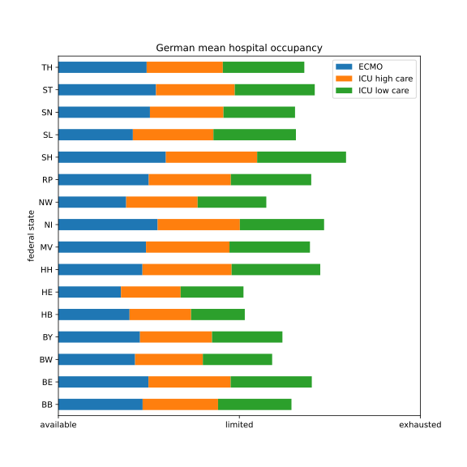

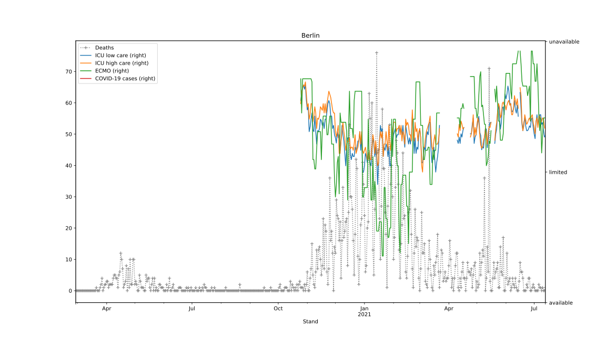
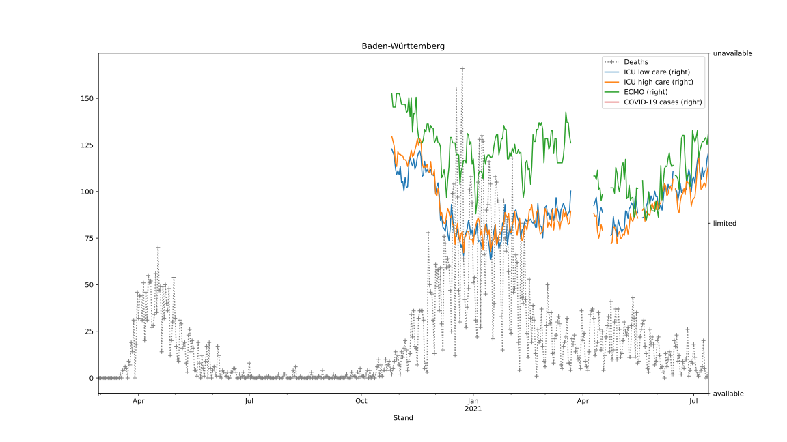
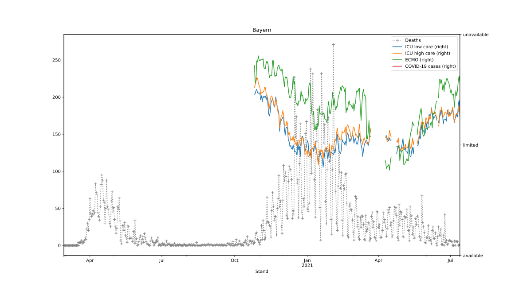
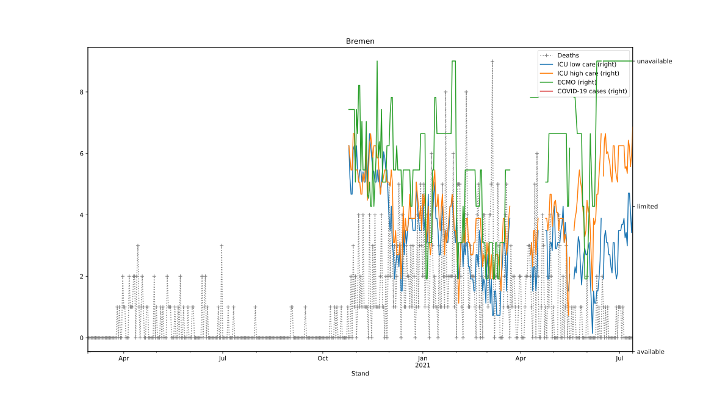
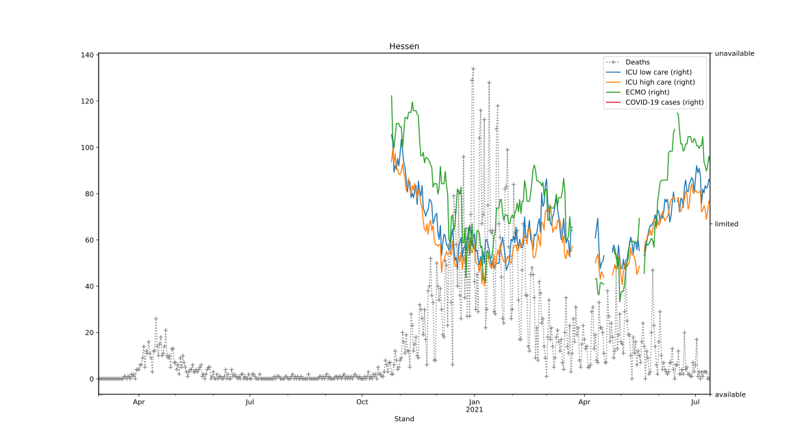
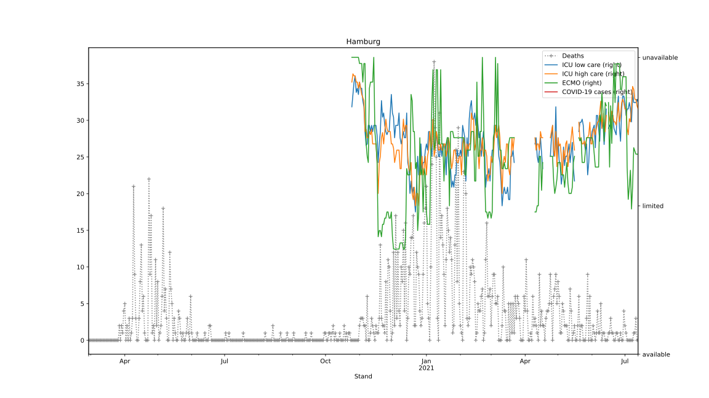
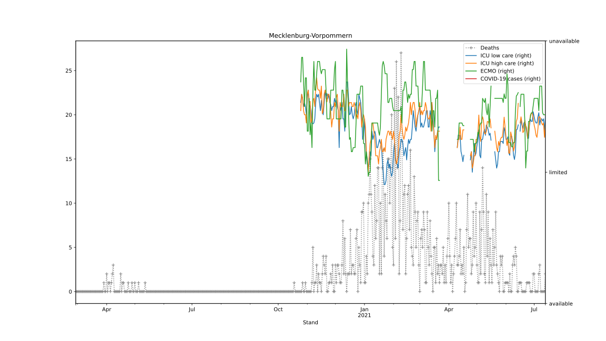
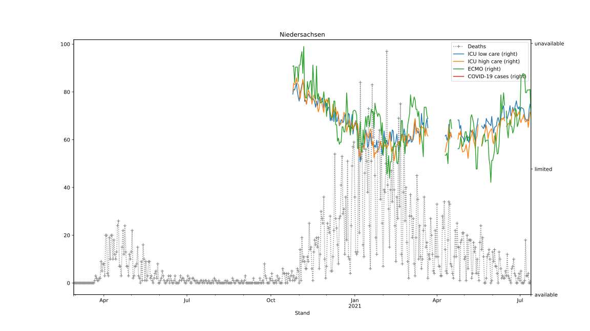
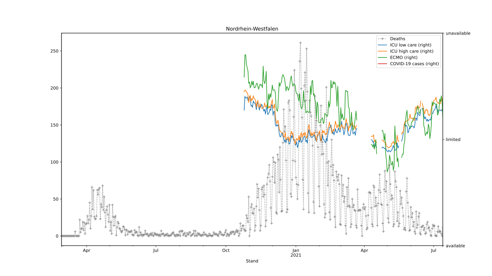
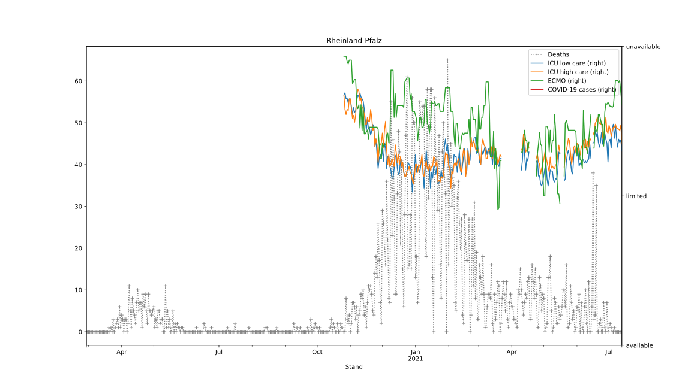
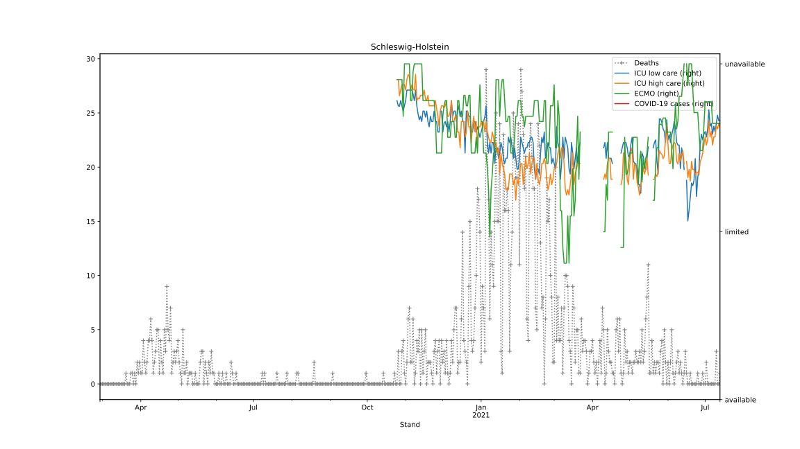
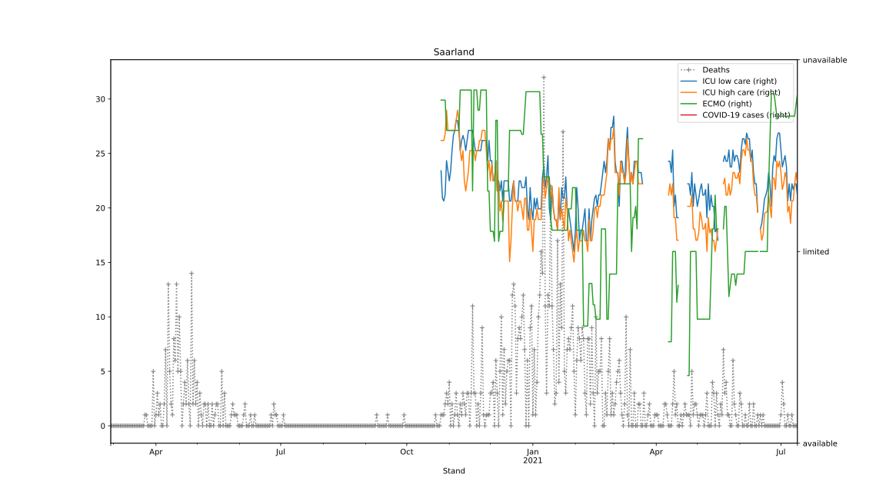

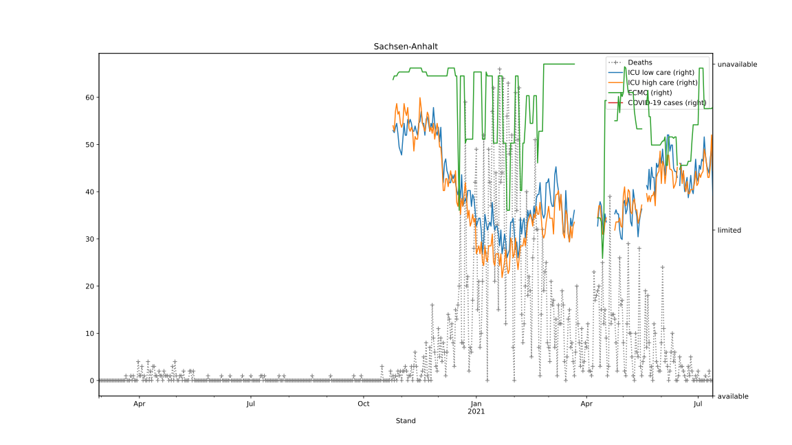
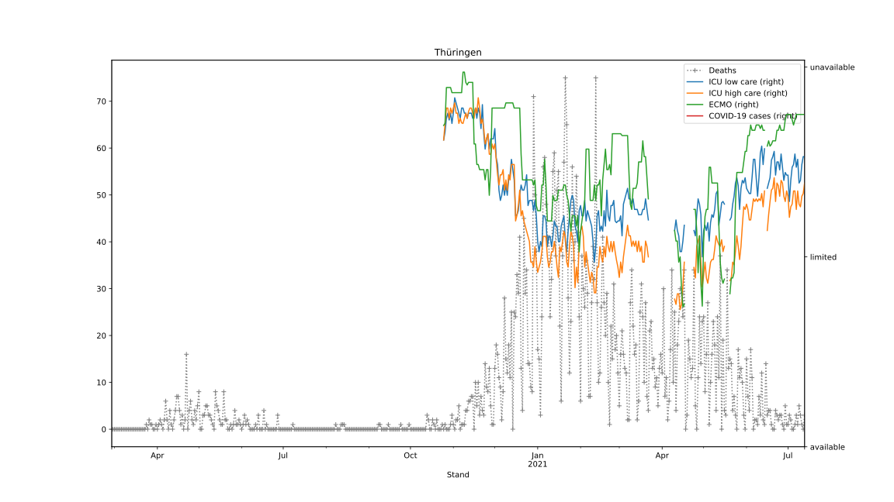
