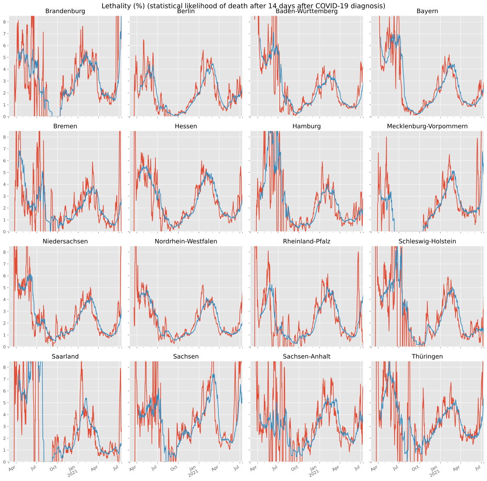

#### Lethality

Lethality is the likelihood for dying after getting infected.
There is reason to assume a delay from the first symptoms to death in letal cases of 14 days. Hence, we compute the COVID-19 lethality at some point of time T with the following formula:

*L*(*T*) = 100% × *Cases*(*T* - 14d) ÷ *Deaths*(*T*)`

Here is how that developed in Germany:

