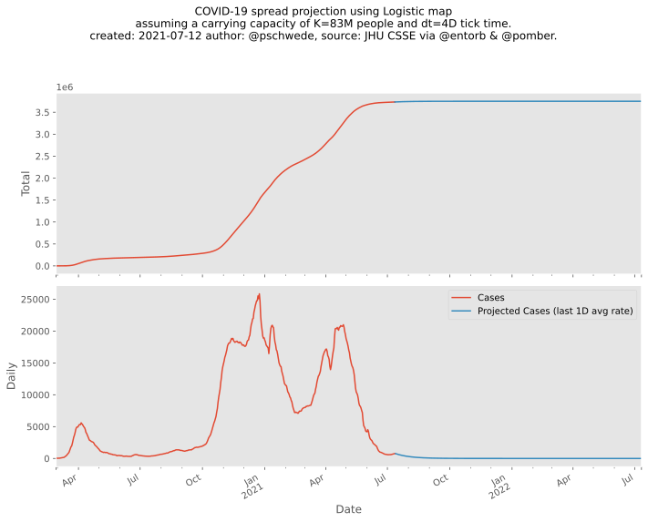

### Projection attempts

#### Naiive Logistic continuation

Assume that the whole population is available for infection. Use the most recent logistic r-values to project into the future.
Some assume that actually four times more people have been infected than is measured through tests (see the curve of "Cases x4".)

