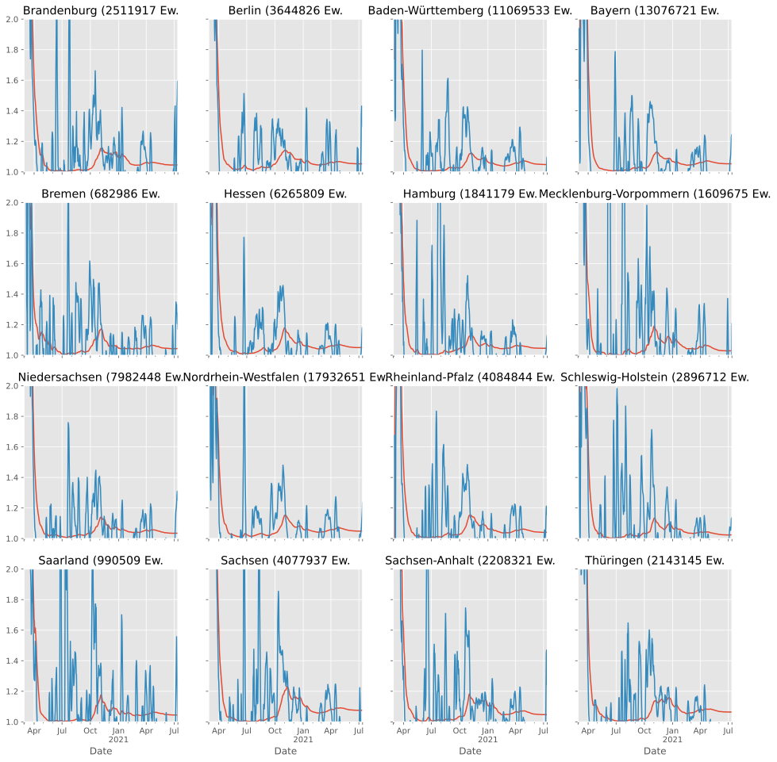
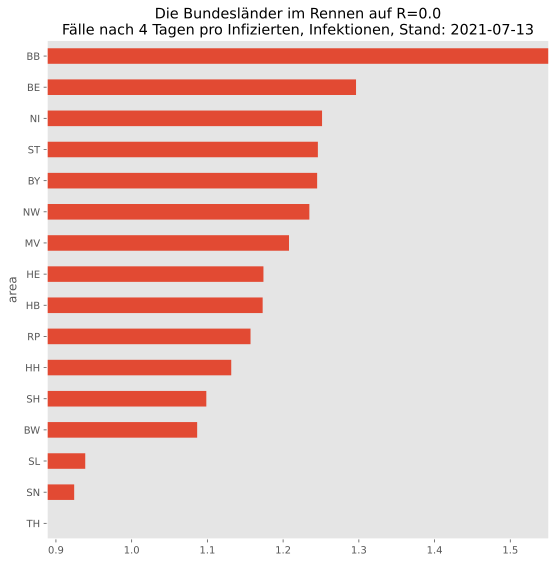
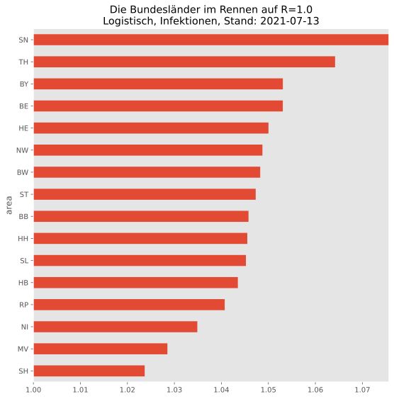
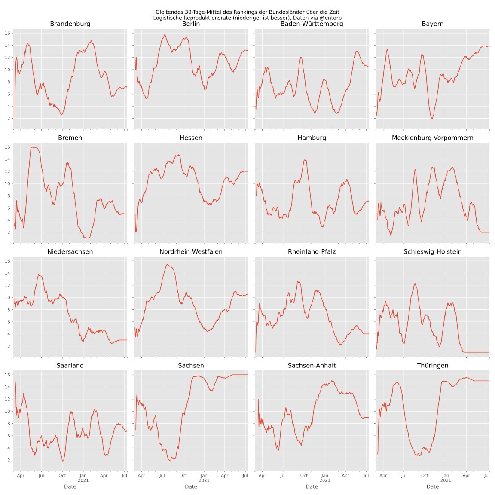
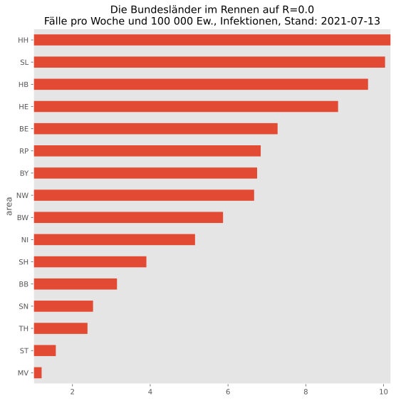
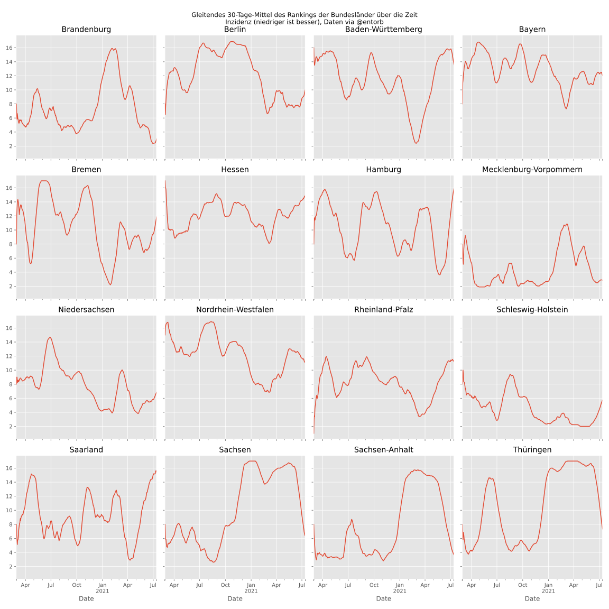

### Reproduction rate

Here, the reproduction rate is computed using the [logistic map](https://en.wikipedia.org/wiki/Logistic_map):

`n(t+1) = r*n(t)*(1-n(t))`

[Solving for r](https://www.wolframalpha.com/input/?i=Solve+n%28t%2B1%29+%3D+r*n%28t%29*%281-n%28t%29%29+for+r):

`r = n(t+1) / (n(t)-n²(t))`

This r-value has a way smoother curve (red) than the 4-days incidence (blue), the RKI first suggested:

#### German federated states race against the pandemic

